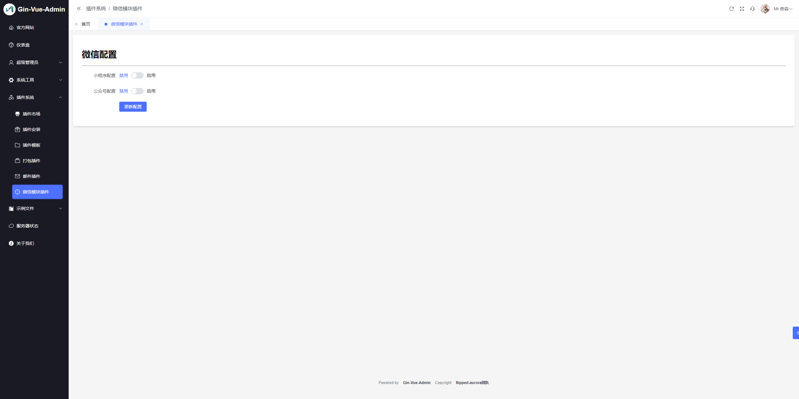

## 微信模块

#### 开发者: ricardo

### 特点

1. [x] 基于gin-vue-admin v2.6.0
2. [x] 支持多端同步微信accesstoken
3. [x] 支持小程序和公众号开发

### 使用步骤

#### 1. 将插件文件夹放入server/plugin目录下

#### 2. 在server/initialize/plugin.go中注册插件

如图所示，案例采用写死的方式，建议添加gva配置文件，使用gva全局配置，例如Email案例


#### 3. 获取accesstoken

你可以在任何你想得到accesstoken的位置调用server/plugin/wechat/common包中的方法获取accesstoken




### 全局配置说明

```go
type Config struct {
	Wechat *config.Wechat // 微信小程序appid和secret和公众号appid和secret
	Rdb    *redis.Client
	Log    *zap.Logger
}
```

### 可直接调用的api

如图所示，已配置swagger

**注意：示例功能为公众号开发，依赖公众号appid和secret，需要开发ip白名单**


### 注意事项

如果你只是单独做**小程序**或者**公众号**开发，可以在server/plugin/wechat/jobs/cron.go中管理你需要同步的令牌