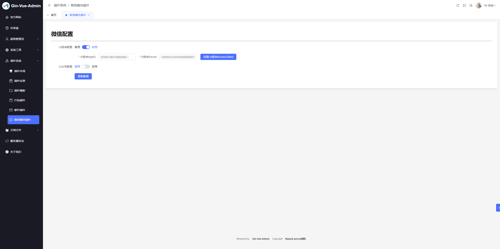

# 微信模块

#### 开发者: ricardo

### 特点

1. [x] 基于gin-vue-admin v2.6.0
2. [x] 支持多端同步获取微信accesstoken
3. [x] 支持小程序和公众号开发
4. [x] 启动时自动生成插件菜单设置权限
5. [x] 动态的微信配置

## 运行截图





## 使用步骤

### 后端
#### 1. 将插件server下的文件夹放入server/plugin目录下

#### 2. 在server/initialize/plugin.go中注册插件

```go
// 微信模块
PluginInit(PublicGroup, wechat.CreateWechatPlug(
    global.GVA_REDIS,
    global.GVA_DB,
    global.GVA_LOG),
)
```

#### 3. 获取accesstoken

你可以在任何你想得到accesstoken的位置调用server/plugin/wechat/common包中的方法获取accesstoken

```go
// GetWechatAccessToken 从中控服务器获取微信AccessToken

// GetWechatPublicAccessToken 从中控服务器获取微信公众号AccessToken

// GetWechatPublicJsApiTicket 从中控服务器获取微信公众号JsApiTicket

// GetWechatConfig 获取微信配置
```


### 全局配置说明

```go
type Config struct {
    Rdb *redis.Client // redis
    Log *zap.Logger // zap日志
    DB  *gorm.DB // db
}
```

### 可直接调用的api

如图所示，已配置swagger

**注意：示例功能为公众号开发，依赖公众号appid和secret，需要开发ip白名单**


### 注意事项

1. 请完成gva初始化之后再完成插件配置
2. 配置文件打开redis的使用
